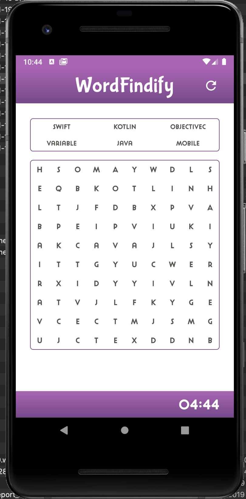
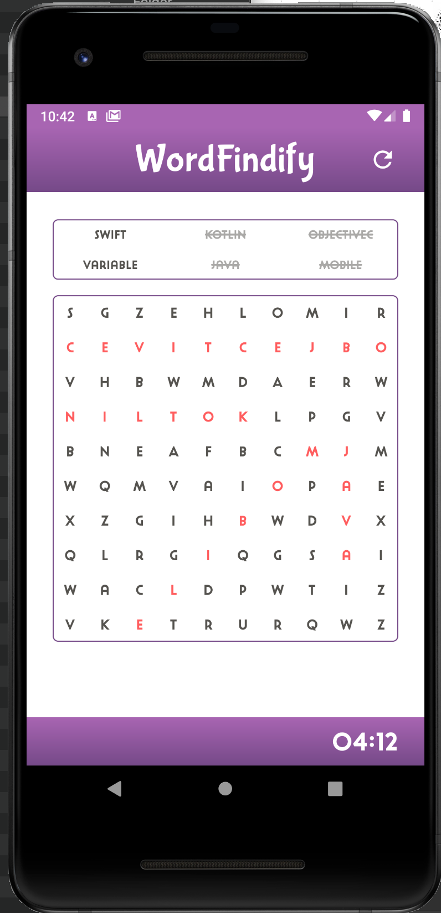
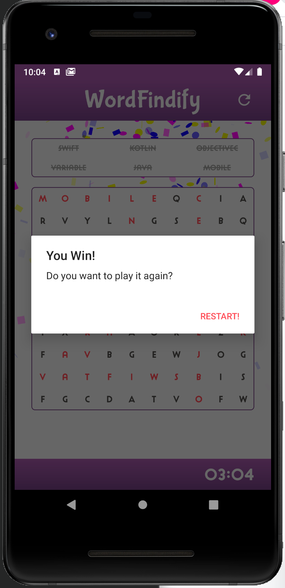

# Shopify-Android-Challenge-Summer-2020
A simple word finder app made in Kotlin

## Objective

Build an Android app that displays a word finder board that can be found swiping over words

Those below are the requirements and the bonus itens that are included in the app:

1. Create a word search mobile app for Android or iOS (depending on the discipline you’re applying to). :white_check_mark:
2. The word search should have at least a 10x10 grid. :white_check_mark:
3. Include at least the following 6 words: Swift, Kotlin, ObjectiveC, Variable, Java, Mobile. :white_check_mark:
4. Keep track of how many words a user has found. :white_check_mark:
5. Make sure it compiles successfully.:white_check_mark:
6. Randomize where the words are placed. :white_check_mark:
7. Make a slick UI with smooth animations. :white_check_mark:
8. Make it look good in portrait and landscape. :white_check_mark:
9. Feel free to add any additional features you can think of. (Swiping sound effects and countdown timer) :white_check_mark:
10. Allow the user to find the words by swiping over the words. :white_check_mark:

## Photos

## Video

